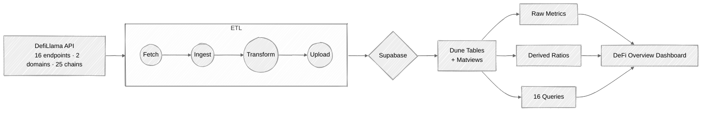

# DeFi Analyst

Cross-chain DeFi analytics, from data pipeline to dashboard. Fetches metrics from [DefiLlama](https://defillama.com/)'s free API across 25 chains, persists in Supabase with incremental ingestion, and delivers daily-updating analysis on Dune.

**Live dashboard:** [DeFi Overview: Cross-Chain Analysis](https://dune.com/ghrjeondata/defi-overview-cross-chain-analysis) 

## Cross-Chain Analysis

Aggregate TVL alone doesn't say much about a $85B+ ecosystem spread across 200+ chains. This dashboard focuses on **capital efficiency** — which chains generate the most fees per dollar locked, where volume is concentrating, and how DeFi revenue composition varies across ecosystems.

- **Aggregate trends** — TVL, daily fees, DEX volume, active addresses, stablecoin mcap, and open interest with 7d/30d moving averages.
- **TVL efficiency and velocity** — fees/TVL has doubled since 2021 even as TVL contracted, suggesting structural improvement in how DeFi monetizes liquidity. Volume/TVL tracks how actively capital is traded.
- **Chain breakdown** — Ethereum anchors 55% of TVL but only 19% of volume. Execution-heavy chains (Solana, Base, Sui) turn over capital at 3–6x Ethereum's rate. Tiered views prevent smaller chains from being flattened out.
- **Fee and TVL compositions** — category breakdowns (DEXs, Lending, Derivatives, Staking, Prediction Markets, etc.) reveal that fee generation is no longer dominated by spot trading. Each chain has a distinct DeFi economy.
- **Growth heatmaps** — month-over-month patterns across chains for TVL, volume, fees, and efficiency.

Derived metrics (velocity, fee efficiency, volume efficiency) are computed in Dune materialized views and the pipeline only handles raw data. 

## The Pipeline

The pipeline turns 16 DefiLlama API endpoints into a structured, daily-updating analytics layer on Dune:



**Supabase as the middle layer.** Raw JSON from DefiLlama is nested, inconsistently shaped, and ephemeral. Supabase provides a persistent, typed store. Incremental ingestion (`MAX(date)` watermark → insert only new rows) means daily runs are fast and efficient — first run ingests all historical data, subsequent runs append only what's new.

**Matviews as the derived layer.** The pipeline uploads raw metrics only. All ratios and moving averages are computed in Dune SQL materialized views. Adding a new derived metric never requires a pipeline change.

16 sources across 6 groups (stablecoins, tvl, volumes, fees, chain_history, users) are parsed, flattened, and merged into 3 Supabase tables: `defi_daily` (7 metrics from 7 API calls → one row per date), `defi_chain_daily` (6 per-chain sources → one row per date+chain), and `defi_chain_category` (3 category snapshots). Scheduled daily via GitHub Actions at 6am UTC.

All data sourced from DefiLlama's free API (no key needed) across [api.llama.fi](https://api.llama.fi/) and [stablecoins.llama.fi](https://stablecoins.llama.fi/), powered by community-maintained protocol adapters ([TVL](https://github.com/DefiLlama/DefiLlama-Adapters) · [volume/fees/derivatives](https://github.com/DefiLlama/dimension-adapters)).

## Built with Claude Code

Pipeline architecture, schema design, DuneSQL queries, and dashboard assembly were developed with [Claude Code](https://claude.ai/claude-code). DefiLlama's [`llms-free.txt`](https://api-docs.defillama.com/llms-free.txt) provided a machine-readable spec for all 31 free endpoints, which informed the mapping of 16 endpoints to 3 Supabase tables.

Three custom skills in `.claude/skills/` encode project conventions:

- **`data-plumber`** — Pipeline patterns: async fetch, Supabase incremental ingestion, transform/upload, matview conventions.
- **`defi-overview`** — Dashboard conventions: derived metrics, query IDs, heatmap patterns, color schemes, table mappings.
- **`dune`** — Dune CLI reference: query management, dataset discovery, visualization, dashboard assembly, DuneSQL syntax.

## Repository Structure

```
run.py                        # Pipeline orchestrator
pipeline/                     # Core pipeline modules
  fetch.py                    #   DefiLlama API → data/raw/ (async)
  ingest.py                   #   data/raw/ → Supabase (incremental)
  db.py                       #   Supabase client + helpers
  transform.py                #   Supabase → data/csv/
  upload.py                   #   data/csv/ → Dune API
schema.sql                    # Supabase table definitions
queries/                      # 16 Dune SQL files (reference copies)
references/                   # Dashboard metadata
  queries.yml                 #   Query IDs, columns, viz IDs
  tables.yml                  #   Uploaded table + matview schemas
  dashboard.yml               #   Dashboard layout, widget positions
  styles.yml                  #   Color palette for charts
articles/                     # Written analysis and articles
reports/                      # Dashboard commentary and narratives
.claude/skills/               # Custom Claude Code skills
.github/workflows/
  pipeline.yml                # Daily pipeline (6am UTC)
```

### Dune tables

| Table | Type | Description |
|-------|------|-------------|
| `dune.ghrjeondata.defi_overview_daily` | uploaded | Aggregate daily timeseries |
| `dune.ghrjeondata.defi_overview_chain_daily` | uploaded | Per-chain daily timeseries |
| `dune.ghrjeondata.defi_overview_chain_category` | uploaded | Category breakdown snapshot |
| `result_defi_overview_daily_metrics` | matview | Aggregate + derived ratios |
| `result_defi_overview_chain_daily_metrics` | matview | Per-chain + derived ratios |

### Derived metrics

| Metric | Formula | What it measures |
|--------|---------|-----------------|
| velocity | dex_volume / tvl | Capital turnover |
| fee_per_tvl | fees / tvl | Revenue per dollar locked |

### Chains tracked

Ethereum, Solana, BSC, Bitcoin, Tron, Base, Arbitrum, Hyperliquid L1, Polygon, MegaETH, Avalanche, Sui, Monad, Optimism, Cronos, Ink, Aptos, Mantle, Starknet, Stellar, Movement, Flare, Cardano, Near, Rootstock.

## Setup

```bash
pip install -r requirements.txt
cp .env.example .env
# Fill in SUPABASE_URL, SUPABASE_SERVICE_KEY, and DUNE_API_KEY
```

Run `schema.sql` in the Supabase SQL Editor to create the tables. For GitHub Actions: add all three as repository secrets.

## Usage

```bash
python run.py                              # full pipeline: fetch → ingest → transform → upload
python run.py --steps fetch,ingest         # specific steps only
python run.py --skip upload                # all except upload
python run.py --full                       # force full ingest refresh
python run.py --dry-run                    # preview without side effects

python -m pipeline.fetch --list            # see all 16 sources
python -m pipeline.ingest --status         # show row counts and latest dates
python -m pipeline.upload --dry-run        # preview upload
```
